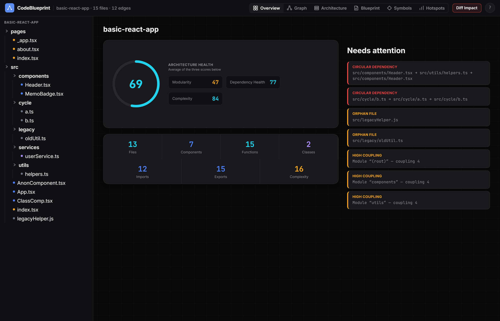
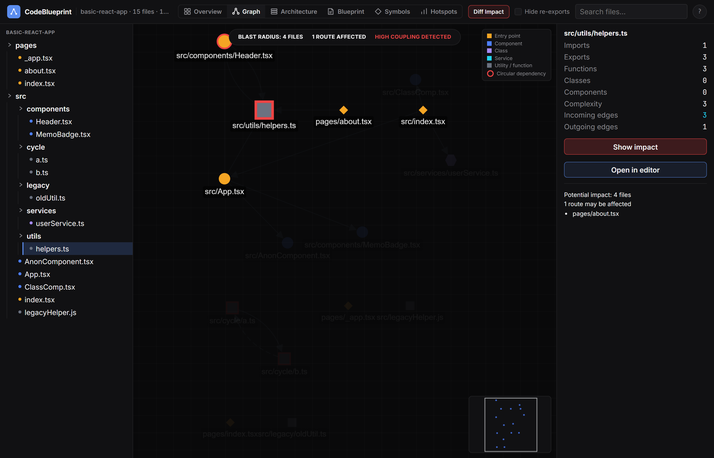

# CodeBlueprint

**See what breaks before you touch it.** CodeBlueprint computes the full transitive blast radius of
changing any file in a JS/TS/React/Next.js codebase — not just its direct importers, the whole
downstream chain — plus a structural summary, a relationship graph, a local web Explorer to browse
it visually, and a live MCP server so your AI assistant can query the same graph instead of grepping.

- `--impact <file>`: the full transitive blast radius of changing a file — the signature feature
- `--impact-diff`: the same blast radius, but for every file git currently reports as changed at once — what does *your actual uncommitted work* touch, not just one hand-picked file
- Structural summary: files, components, functions, classes, imports/exports, circular deps, orphan files
- `--graph`: a full file/symbol/usage dependency graph
- `--hotspots`: most-connected files, circular-dependency chains, per-module coupling/complexity
- `--serve`: a local web Explorer — pan/zoom graph, search, per-file inspector, impact highlighting
- `--mcp`: an MCP server so Claude Code/Cursor/Copilot can query the graph directly, no grepping
- Basic npm/yarn monorepo support — see "Monorepo support" below





## Quick start

```
cd my-project
npx codeblueprint
```

No install needed — `npx` fetches and runs it. With no path argument, it analyzes whatever
directory you're already in — the same convention `git status`/`eslint .` use. Point it at a
different directory with `npx codeblueprint ./my-project`. Add `--json`/`--graph`/`--hotspots`/
`--impact`/`--serve`/`--mcp` per the flags below.

## Usage

```
codeblueprint [path]
codeblueprint [path] --json
codeblueprint [path] --graph
codeblueprint [path] --hotspots [--json]
codeblueprint [path] --impact <file> [--json]
codeblueprint [path] --impact-diff [--json]
codeblueprint [path] --serve [--port <number>]
codeblueprint [path] --mcp
codeblueprint --version
```

`[path]` defaults to the current directory when omitted.

## Local development

```
npm install
npm run build
npm link          # makes `codeblueprint`/`npx codeblueprint` resolve to this local build
codeblueprint ./my-project
```

`npm install` also installs the `web/` Explorer frontend's dependencies (it's an npm workspace), and `npm run build` builds both the CLI and `web/`, copying the built Explorer into `dist/ui` so `--serve` has something to serve. See "Explorer (`--serve`)" below for the frontend dev workflow.

Or without linking: `node dist/cli.js ./my-project`, or `npm run dev -- ./my-project` for fast iteration via ts-node.

## Output

```
CodeBlueprint

Project: my-project

Files             184
Components        73
Functions         612
Classes            18
Imports           924
Exports           431

Circular deps       3
Orphan files        8

Run with --serve to explore visually, or --mcp to let your AI assistant query this directly.
```

On a real terminal (not piped/redirected), the header and any nonzero Circular deps/Orphan files
count are colorized — automatically disabled when output isn't a TTY, so `--json`/scripted/piped
usage is never polluted with escape codes.

`--json` prints the same data as a `Summary` object (see `src/model.ts`), including the raw file lists for each circular-dependency cluster and each orphan file — useful for scripting or as a stepping stone for Phase 2's graph visualization.

`--graph` prints a `CodeGraph` object instead: file-level import/re-export edges, every function/method/class/component declaration as a `SymbolModel`, which files import which specific symbols, and symbol-to-symbol `calls`/`renders` usage edges (e.g. `authService.ts#login` calls `db.ts#query`, `App.tsx#App` renders `Header.tsx#Header`). It's a separate flag from `--json` (not merged into `Summary`) so existing `--json` scripting consumers don't see their payload shape change, and so the extra language-service work it does is only paid when actually asked for. See "Known Phase 2 limitations" below for what it deliberately doesn't resolve.

## Architecture intelligence (`--hotspots`)

```
codeblueprint ./my-project --hotspots
codeblueprint ./my-project --hotspots --json
```

Prints (or, with `--json`, returns as a `HotspotReport` object) three things `--graph`'s raw edge
data doesn't surface on its own:

- **Most connected files** — the top 10 files by in-degree (`dependents`: how many other files
  import each one), reusing `graph.ts`'s existing `inDegrees` rather than a new computation.
- **Circular dependencies as an actual chain** — `src/a.ts → src/b.ts → src/a.ts`, not just the
  unordered file list `Summary.cycles` already reports. `graph.ts`'s `findCyclePath` walks a real
  edge-connected path through each cycle's member set.
- **Per-module Coupling / Complexity / Dependencies bars** — a "module" is the top-level directory
  under the project root (or under `src/`, if one exists; see `src/modules.ts`'s `moduleNameForFile`
  for the exact rule, including how root-level files are bucketed). Complexity is real McCabe
  cyclomatic complexity per function (`analyzer.ts`'s `getCyclomaticComplexity`, counting
  `if`/`for`/`while`/`case`/`catch`/ternary/`&&`/`||`), averaged per file across the module.
  Coupling is afferent + efferent cross-module file-level edges (Ca + Ce). Dependencies is the
  summed `importCount` of the module's files. All three are raw numbers in `ModuleMetrics` —
  `report.ts` and the Explorer's Hotspots panel each independently normalize them into bars for
  display, consistent with how every other report in this codebase keeps `model.ts` as plain data.

`--hotspots` composes with `--json` as a pure format toggle (same as the base command's `--json`
already does for `Summary`), and is mutually exclusive with `--graph`/`--serve` (different modes).

## Impact analysis (`--impact <file>`)

```
codeblueprint ./my-project --impact src/authService.ts
codeblueprint ./my-project --impact src/authService.ts --json
```

The roadmap's signature feature: "Potential impact: N files" — the *full transitive* blast radius
of changing a file, not just its direct importers. `graph.ts`'s `findDependents` does a BFS over
the reversed dependency graph outward from the target, so a file three imports away that only
depends on the target indirectly still shows up — cycle-safe (a file never reappears in its own
impact set, even through a back-edge). The report also calls out `impactedRoutes`: the subset of
impacted files that are actual application routes (Next.js `pages/**`/`app/**`, via
`entrypoints.ts`'s `computeRoutes` — a route-specific predicate distinct from the broader
`computeEntryPoints`, which also includes test/config files that aren't routes).

`<file>` resolves relative to the project root (the `<path>` argument), not your shell's current
directory, so the result doesn't depend on where you happen to run `codeblueprint` from; absolute paths
work too. A path that doesn't match any scanned file is a clear error, not a silent empty report.

The result is deliberately a flat file list, not a depth-grouped tree — the Explorer's graph
(`--serve`, below) already renders the real edge structure once impacted nodes are highlighted, so
that *is* the chain visualization; a synthetic tree would just reproduce what the graph gives for
free. `--impact` composes with `--json` (same format-toggle pattern as `--hotspots`) and is mutually
exclusive with `--graph`/`--hotspots`/`--serve`.

## Diff Impact (`--impact-diff`)

```
codeblueprint ./my-project --impact-diff
codeblueprint ./my-project --impact-diff --json
```

Same blast-radius analysis as `--impact`, but for every file git currently reports as changed at
once, instead of one manually-picked target — "what does my actual uncommitted work touch, right
now." "Changed" means staged + unstaged modifications to tracked files (`git diff --name-only
HEAD`) plus untracked files (`git status --porcelain`); a clean working tree or a directory that
isn't a git repository just reports zero changed files rather than erroring. The result is the
deduped *union* of every changed file's own impact set — a file you changed is never counted as
"impacted" just because another one of your changes also touches it — plus a per-file breakdown
(`perFile`) showing how much impact each individual change contributes, so you can spot which one
of several changes is the risky one. `--impact-diff` composes with `--json` and is mutually
exclusive with `--graph`/`--hotspots`/`--impact`/`--serve`/`--mcp`.

`git`'s diff/status output is always relative to the repository's toplevel, not the directory
`codeblueprint` was pointed at — resolved paths are normalized against the real repo root (via `git
rev-parse --show-toplevel`) and then filtered back down to files under `<path>`, so pointing
`codeblueprint` at one package of a larger monorepo only reports that package's own changes, not
unrelated changes elsewhere in the same repo.

Known gaps, same safe-failure-mode spirit as everything else in this README: a renamed file's `git
status` line resolves to its new path only (the old path is dropped, not double-counted); a deleted
file has no on-disk content left to analyze, so it's silently excluded from the report rather than
erroring.

## Explorer (`--serve`)

```
codeblueprint ./my-project --serve
codeblueprint ./my-project --serve --port 5000
```

Starts a local HTTP server (default port `4787`) and opens your browser to a graphical Explorer: a file-tree sidebar shared across every view, a header toggle switching between six views (Overview, Graph, Architecture, Blueprint, Symbols, Hotspots), a command palette (`Ctrl`/`Cmd+K`) for jumping straight to any file or symbol by name, and a keyboard-shortcuts panel (press `?`) covering view-switching (`o`/`g`/`a`/`b`/`s`/`h`), search focus (`/`), and the palette.

- **Overview** — the landing view: an Architecture Health score (the average of three independently-justified sub-scores — Modularity, Dependency Health, Complexity — each drillable into the specific files/reasons behind the number, never a bare number with no explanation) and a "Needs attention" list (circular dependencies, orphan files, high-coupling modules), every item clickable straight through to the relevant file/view.
- **Graph** — a pan/zoom/click dependency graph (Cytoscape.js), a search box that highlights matching files and fades the rest, a "Hide re-exports" toggle that fades out `reExport`-kind edges (`FileEdge.kind` is tagged specifically for this), and an inspect panel showing the selected file's metrics (imports/exports/functions/classes/components/complexity, entry-point status, incoming/outgoing edge counts). A "Show impact" button in the inspect panel fetches `GET /api/impact?file=<path>` and highlights the result directly on the graph — the target file gets a distinct border, its impacted dependents turn gold, everything else fades, reusing the exact same highlight mechanism the search box already uses (impact takes priority over search while active, and clears on reselection or a new search term). Impact analysis renders as concentric rings by real hop distance around the target, rather than the graph's normal force-directed layout, so the tool's most differentiated moment looks distinct instead of reusing the generic dependency-graph shape. A header **"Diff Impact"** button (mutually exclusive with a single-file "Show impact") fetches `GET /api/diff-impact` and highlights the combined blast radius of every file git currently reports as changed — see "Diff Impact" above — with one ring-set per changed file. A second inspect-panel button, "Open in editor," hits `GET /api/open-source?file=&line=`, which opens the file at that line in your local editor (VS Code via its CLI, falling back to the OS's default file handler) — clicking a symbol node in the Symbols view does the same, jumping straight to its declaration line.
- **Architecture** — files grouped into layers (Presentation, Application, Services, Data, Infrastructure, and an honest "Other" catch-all for anything the folder-convention heuristic can't classify) instead of one flat force-directed cloud.
- **Blueprint** — an auto-generated, always-in-sync layered architecture diagram derived from the same layer classification, rendered as a fixed layout rather than an exploratory graph.
- **Symbols** — the *selected file's* own functions/classes/components plus a multi-hop call-chain trace from any of its symbols (`web/src/components/SymbolGraphView.tsx`, backed by `GET /api/code-graph` — the same `CodeGraph` data `--graph` prints, computed once at server startup).
- **Hotspots** — the same data `--hotspots` prints as text — a connected-files list, cycle chains, and per-module coupling/complexity/dependency bars (`web/src/components/HotspotsPanel.tsx`), served from `GET /api/hotspots`.

Unlike `--json`/`--graph`/`--hotspots`/`--impact`/`--impact-diff`, `--serve` doesn't print anything machine-readable to stdout — it's meant to be looked at, not piped — so it's mutually exclusive with the other five (combining them is a usage error, not a silently-ignored combination).

The Explorer's node set includes every scanned file, including orphans with zero edges — deliberately different from `CodeGraph.files`' edges-only shape (`--graph`), since a graph UI needs every file to draw as a node, not just the ones with a visible edge. This is `ExplorerData` (see `src/model.ts`): `ProjectModel.files` for the complete file list plus `codeGraph.ts`'s file-level edges, assembled by `orchestrator.runExplorerData()` in a single project parse.

**Remaining scope gap**: "focus on this module" (isolating one directory's subgraph) is the one roadmap Phase 3 idea still deferred, not designed away — everything else originally listed here (edge-type filtering, jump-to-source, the symbol/call-graph view) has since shipped.

**Frontend dev workflow**: the Explorer lives in `web/` (Vite + React + TypeScript + Cytoscape.js), a separate npm workspace from the CLI with its own `tsconfig.json` — it targets the browser (ESNext modules, DOM lib) where the CLI targets Node (CommonJS). `web/src/types.ts` is a small hand-kept mirror of the relevant `src/model.ts` types, since the two packages don't share a compilation context. To iterate on the UI with hot reload: run `codeblueprint <path> --serve` in one terminal (serves the API on port 4787), then `npm run dev --workspace=web` in another (`web/vite.config.ts` proxies `/api` to port 4787).

## MCP server (`--mcp`)

```
codeblueprint ./my-project --mcp
```

Starts a local [MCP](https://modelcontextprotocol.io) server over stdio, so an AI coding assistant
(Claude Code, Cursor, Copilot, or any other MCP client) can query this project's dependency/symbol
graph directly instead of grepping files. Seven read-only tools, each a thin wrapper over the same
analysis primitives every other flag uses — no separate analysis pipeline:

- `get_summary` — project-wide structural summary (same data as the base command)
- `get_file_summary` — one file's metrics (imports/exports/functions/classes/components/complexity)
- `get_dependencies` — a file's direct dependencies and dependents
- `find_symbol` — find functions/classes/components by name (case-insensitive substring match)
- `get_impact` — the full transitive blast radius of changing a file (same as `--impact`)
- `get_diff_impact` — the combined blast radius of every file git currently reports as changed (same as `--impact-diff`) — lets an AI agent sanity-check the blast radius of its own uncommitted edits before finishing a task
- `get_hotspots` — most-connected files, circular-dependency chains, per-module coupling (same as `--hotspots`)

Like `--serve`, the project is parsed exactly once at startup; every tool call after that is a cheap
in-memory query, not a fresh scan. `--mcp` is mutually exclusive with the other flags, and — critically
— writes nothing to stdout itself, since stdout *is* the MCP wire protocol; only the SDK's own
JSON-RPC framing goes there.

To register it with an MCP client, add an entry to the client's MCP config (e.g. Claude Code's
`.mcp.json`):

```json
{
  "mcpServers": {
    "codeblueprint": { "command": "npx", "args": ["codeblueprint", "--mcp", "."] }
  }
}
```

(Check your specific client's documented config format/location — the shape above is Claude Code's.)

## Monorepo support

Point `<path>` at a monorepo's root and CodeBlueprint automatically detects an npm/yarn workspace (a
`"workspaces"` field in the root `package.json`, either the plain array form or yarn's `{"packages":
[...]}` object form) or, if that's absent, a pnpm workspace (a `pnpm-workspace.yaml` file's own
`packages:` list, parsed with a real YAML parser) — and scans every discovered package as part of the
same project — no flag needed, the same way `tsconfig.json`/`.gitignore` are already picked up
automatically. This fixes the biggest
practical issue with a naive single-project scan: a package that nothing else in the monorepo imports
(a leaf app, say) is no longer misreported as an orphan just because its own `package.json`/`index.*`
weren't checked outside the invoked root — each workspace package's own entry points are now
recognized too (`entrypoints.ts`'s `computeEntryPoints`, via a `packageRoots` parameter). Everything
else — `--graph`, `--hotspots`, `--impact`, `--impact-diff`, `--serve`, `--mcp` — works across package
boundaries for free once an edge exists, since none of them are aware a package boundary was ever
crossed.

Detection is root-only: run `codeblueprint` against the monorepo's actual root, not a single package's
own subdirectory nested inside a larger workspace — CodeBlueprint doesn't walk upward looking for an
ancestor workspace.

## Metrics — what's actually counted

- **Files**: `.js/.jsx/.ts/.tsx/.mjs/.cjs/.mts/.cts` files, excluding `node_modules`, `dist`, `build`, `.next`, `out`, `.git`, `coverage`, and anything matched by the project's own `.gitignore`. `.d.ts` files are excluded.
- **Imports**: counted per `import` statement (not per named specifier), including `import type`. Dynamic `import()` and `require()` calls are **not** counted toward this number (though `require()` calls *are* tracked as file-level graph edges — see Known Phase 1 limitations below for the distinction).
- **Exports**: counted per uniquely-named exported symbol per file (named, default, and re-exports via `export * from`/`export {x} from`).
- **Functions**: function declarations, arrow/function expressions bound to a variable (`const f = () => {}`) — including through one or two layers of `memo`/`forwardRef`/`observer` wrapping — anonymous default exports (`export default () => {}`), and class methods (excluding constructors/getters/setters). Inline callbacks with no such binding (e.g. `arr.map(x => ...)`) are deliberately excluded to avoid noise. **Components intentionally double-count as Functions** — a component is a function; "Components" is a tag on a subset, not a disjoint partition.
- **Classes**: `class` declarations, including anonymous `export default class {}`, plus class *expressions* assigned to a variable (`const X = class {}`).
- **Components** (heuristic): capitalized (or anonymous-default-exported) functions/arrows whose body contains JSX, plus classes (declarations or expressions bound to a variable) extending `React.Component`/`PureComponent`. Known false positives: a capitalized non-component factory function that happens to return JSX. Known false negatives: `React.createElement(...)`-based components with no JSX syntax; HOC wrapping beyond `memo`/`forwardRef`/`observer` — `connect(mapState)(Component)` (react-redux) is curried, a structurally different case this mechanism doesn't attempt; `styled(Component)` doesn't fit the mechanism's premise at all (there's no already-named inner declaration being wrapped — it constructs a new component), so forcing it in was deliberately avoided rather than risking a wrong attribution.
- **Circular deps**: the number of distinct strongly-connected clusters (Tarjan's SCC) in the file-level import/re-export graph — not the number of raw edges, and not the number of files involved. A 5-file cycle counts as 1, not 5.
- **Orphan files**: files with zero internal importers that also aren't recognized as an entry point. Entry points include `package.json`'s `main`/`module`/`browser`/`exports["."]`/`bin` fields, `index.*`/`main.*` at the project root or in `src/`, Next.js `pages/**` and `app/**/{page,layout,loading,error,not-found,route,template,default}.*` + `middleware.*`, test files (`*.test.*`, `*.spec.*`, `__tests__/**`), Storybook `.stories.*` files, and root-level `*.config.{js,ts,cjs,mjs}` files. Known false positive: dynamically-constructed `import()`/`require()` strings (e.g. built from a variable at runtime) aren't resolved.

Every phase of the roadmap is now implemented; the limitations below are the known, deliberate gaps
in each — none of them produce a wrong result, they simply produce no result (a dropped edge, an
unrecognized entry point), which is the safe failure mode for a tool whose job is showing real
relationships.

## Known Phase 1 limitations

- **CommonJS-only files** (`module.exports`/`require()`) still show 0 imports/exports in the Metrics counts — there's no CommonJS export/symbol modeling. `require("./x")` calls *are* tracked as file-level graph edges (kind-tagged `"require"`, resolved on disk the same way `import` specifiers are), so a file only ever reached via `require()` is no longer misreported as an orphan or a disconnected Explorer node — only the CommonJS-only `fixtures/basic-react-app/src/legacyHelper.js` fixture file itself still looks disconnected, since its own `require("fs")` call is a Node builtin, not an internal file.
- **`tsconfig.json` `exports` field**: only the top-level `"."` entry is resolved; full conditional-exports maps are not.

## Known Phase 2 limitations

`--graph`'s symbol-usage resolution (`calls`/`renders` edges) is built on ts-morph's go-to-definition, which is real but not exhaustive static analysis. Known gaps, none of which produce a wrong edge — they simply produce no edge, which is the safe failure mode for a tool whose job is showing real relationships:

- **Dynamic dispatch / reassigned function references** (`let f = a; if (x) f = b; f()`): resolves to the variable binding, not to `a` or `b`.
- **Higher-order functions returning functions** (`const handler = makeHandler(); handler()`): resolves to the `handler` binding, not into `makeHandler`'s return statement.
- **Method calls through interface-typed values**: resolve to the interface's method signature, not a concrete class implementation — the same ambiguity TypeScript's own go-to-definition has.
- **Calls through array/object literals of functions** (e.g. `[fn1, fn2][0]()`) are not walked.
- **Namespaced JSX tag names** (`<ns:tag/>`, rare/legacy JSX syntax) aren't resolved to a symbol.

## Known Phase 3 limitations

- **The Symbols view is per-file, not whole-project** — selecting a file shows its own symbols plus one hop of `calls`/`renders` neighbors, not a project-wide call graph; a deliberate scope choice for readability, not a technical limitation (`--graph`'s full `CodeGraph` data has everything needed for the latter).
- **"Focus on this module"** (isolating one directory's subgraph in the Graph view) is still deferred — see "Explorer" above.

## Known Phase 6 limitations

- **Root-only detection, no ancestor walk** — see "Monorepo support" above.
- **Workspace glob patterns**: only a single trailing `*` segment (`"packages/*"`) is expanded.
  `**`, mid-path wildcards, and brace expansion aren't supported — every real workspace field
  observed in practice is a short literal list or a single `dir/*` pattern, so this covers the
  realistic cases without a real glob dependency. A literal directory with no wildcard also works.
- **No per-package `tsconfig.json`/`.gitignore` merging** — only the invoked root's own `tsconfig.json`
  `paths` and `.gitignore` are honored; a package's own `tsconfig.json` path aliases aren't merged in.
  Full TS project-references resolution is out of scope for "basic" support.
- **Bare cross-package imports** (`import {x} from "@myorg/lib"`, with no `tsconfig` `paths` alias)
  only resolve after `npm install` has created the `node_modules` symlinks — before install, or
  without a `paths` alias, the edge is silently dropped rather than guessed at.

## Project layout

`analyzer.ts`/`graph.ts`/`componentHeuristics.ts` produce plain data (`ProjectModel`/`Summary` in `model.ts`); `report.ts` is the only module that knows about stdout formatting. `codeGraph.ts` builds the `CodeGraph` data (`--graph`) on top of the same `analyzer.ts`/`componentHeuristics.ts` primitives, so file-level edges and function/component detection aren't computed twice. `orchestrator.runExplorerData()` derives `ExplorerData` from one parse — used directly by any future standalone/scripting consumer — while `server.ts` (`--serve`) instead calls `orchestrator.loadServerData()`, which derives that same `ExplorerData` alongside `HotspotReport`/`CodeGraph`/impact-computation closures from a single shared parse (see its own comment for why: three independent full ts-morph parses at every `--serve` startup would otherwise be paid for one), and serves the prebuilt `web/` frontend as static assets plus a `/api/explorer-data` JSON endpoint. `modules.ts` groups `FileModel`s into per-directory modules and computes their coupling/complexity/dependency numbers, feeding `orchestrator.runHotspotReport()` (`--hotspots`, and `/api/hotspots` for the Explorer). `graph.ts`'s `findDependents` (a BFS over the reversed dependency graph) and `entrypoints.ts`'s `computeRoutes` feed `orchestrator.runImpactAnalysis()`/`loadImpactContext()` (`--impact`, and a per-request `/api/impact` for the Explorer — the one endpoint that isn't computed once at server startup, since its result depends on which file was clicked). `git.ts`'s `getChangedFiles()` (a thin `git diff`/`git status` wrapper, never throwing) feeds `orchestrator.runDiffImpactAnalysis()`/`loadDiffImpactContext()` the same way (`--impact-diff`, and `/api/diff-impact`) — the union of `findDependentsFromReverse` run once per changed file, reusing the exact same reversed graph and BFS `--impact` already built, no separate computation path. This split is deliberate — `orchestrator.ts`'s entry points (`runAnalysis`/`runGraphAnalysis`/`runExplorerData`/`runHotspotReport`/`runImpactAnalysis`/`runDiffImpactAnalysis`/`loadMcpContext`) are the only things any consumer (CLI, server, MCP, or a future scripting use) needs to call; none of them touch ts-morph or stdout formatting directly.

## Testing

```
npm test
```

Runs `node:test` against `graph.ts` (including `findCyclePath`/`findDependents`), `analyzer.ts`'s `getCyclomaticComplexity`/`getDependencyEdges` (including `require()` edge resolution against real hermetic temp directories, since it resolves on disk rather than through ts-morph)/`getClassExpressionCandidates`, `entrypoints.ts`'s `computeRoutes` (including Storybook `.stories.*` recognition), `modules.ts`, `utils/format.ts` (including `formatBar`), `report.ts`'s `formatHotspotReport`/`formatImpactReport`/`formatDiffImpactReport`, `codeGraph.ts` (including class-expression symbol registration, barrel re-export attribution, dotted JSX tags, `.bind()`/`.call()`/`.apply()` resolution, and namespace-import attribution — each with both a positive case and a negative case guarding against misattributing an unrelated same-named binding), `git.ts`'s `getChangedFiles` (against real hermetic temp git repos, including a subdirectory-of-a-larger-repo case since git's own diff/status output is toplevel-relative, not cwd-relative), `workspace.ts`'s workspace-detection primitives (both npm/yarn's `package.json` field and the `pnpm-workspace.yaml` fallback), `orchestrator.ts`'s `runExplorerData`/`runHotspotReport`/`runImpactAnalysis`/`runDiffImpactAnalysis`, `server.ts` (API shape and static serving, both against hermetic fixtures rather than the real `web/dist`), and an integration suite that asserts exact metric values against `fixtures/basic-react-app` — a hand-built fixture with a known circular pair, a barrel-style re-export cycle, a second disjoint cycle, a genuinely orphaned file, a CommonJS-only file (demonstrating the limitation above), Next.js `pages/*` entry points (including `about.tsx`'s import of a shared util, giving `--impact` a real affected-route case to assert against), a tsconfig path-alias import, a `memo`-wrapped and an anonymous-default-exported component, and a typed class/method pair (demonstrating `--graph`'s call-resolution through a `PropertyAccessExpression`), plus a second integration suite against `fixtures/basic-monorepo` (a 2-package npm workspace with a cross-package `tsconfig` path alias) asserting the orphan-misreporting regression is actually fixed, and (regression test for the barrel-attribution fix) that a named import through a re-export barrel resolves to the real originating symbol. `npm test` never requires `web/` to be built first.

The Explorer frontend (`web/`) has no automated tests — the project has no UI-render test infrastructure prior to this, and the fixture's known cycles/orphan/entry-points make it a good manual test bed. Verify frontend changes by running `codeblueprint ./fixtures/basic-react-app --serve` and checking the result in a browser, not just `tsc`/`vite build` succeeding.
